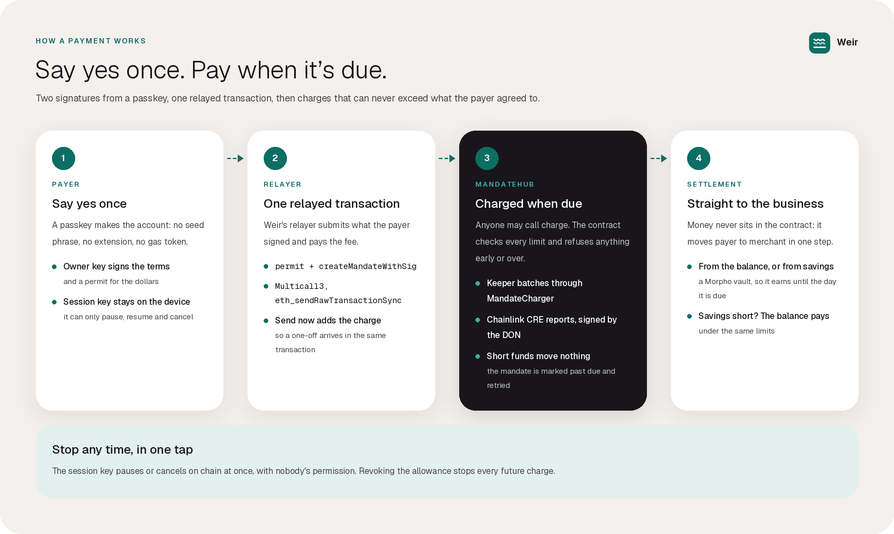
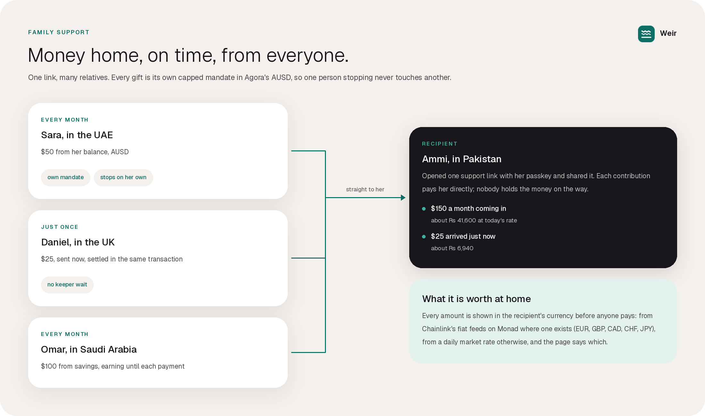
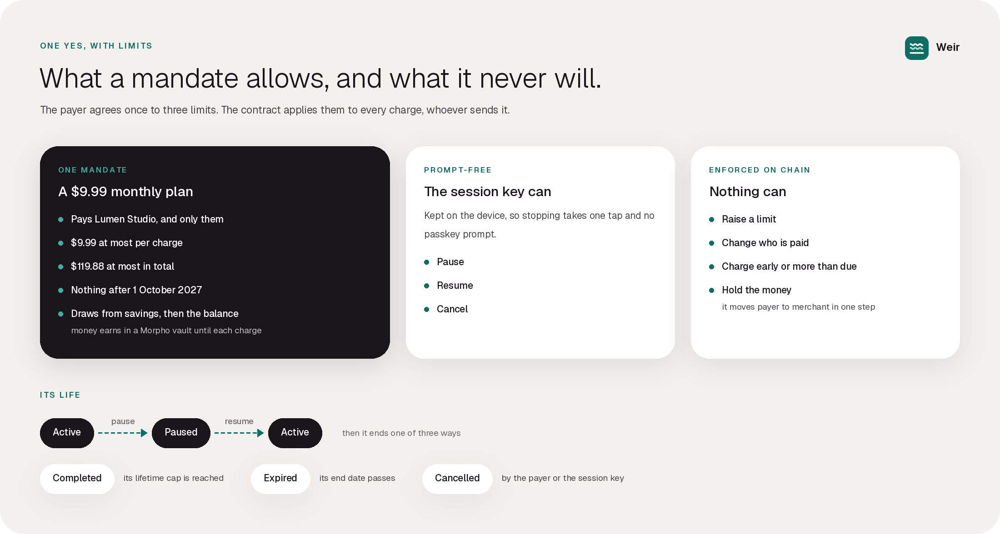
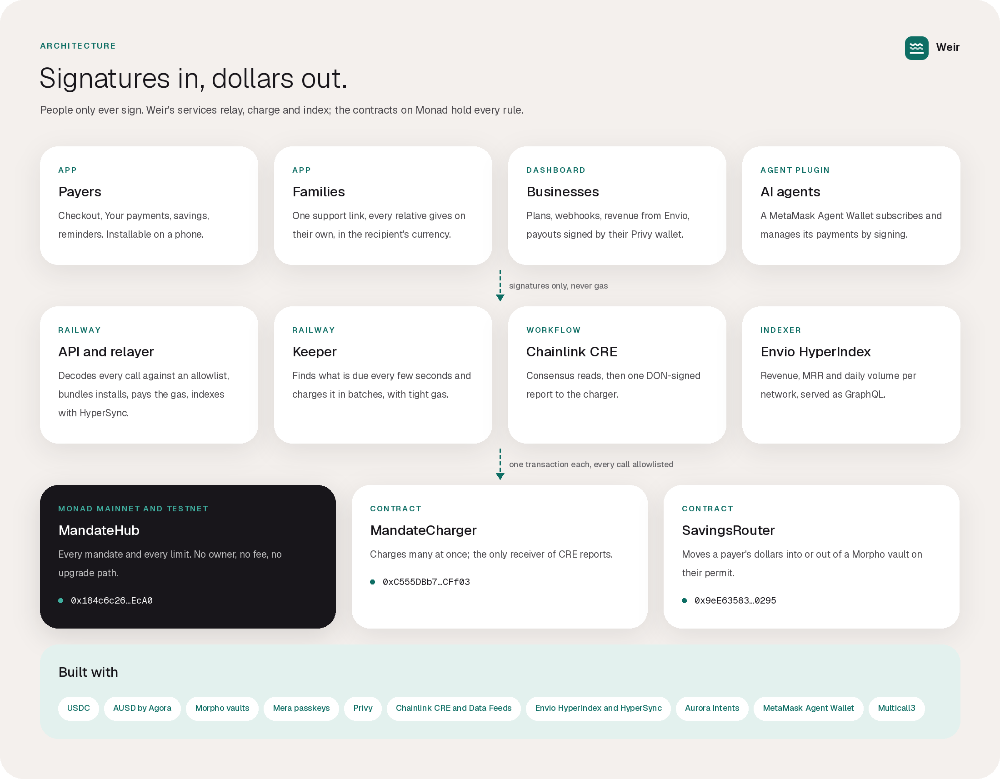

<p align="center">
  
</p>

<p align="center">
  <a href="https://app-weirpay.vercel.app"></a>
  <a href="https://monad.xyz/developers/hackathons/metropolis"></a>
  <a href="docs/verification.md"></a>
  <a href="https://github.com/ArhamKhan117/Weir/actions/workflows/test.yml"></a>
  <a href="https://github.com/ArhamKhan117/Weir/actions/workflows/app.yml"></a>
  <a href="https://github.com/ArhamKhan117/Weir/actions/workflows/live.yml"></a>
  <a href="LICENSE"></a>
  <a href="https://x.com/weirstudio"></a>
</p>

<p align="center">
  <a href="https://app-weirpay.vercel.app"><b>Open the app</b></a>
  &nbsp;·&nbsp;
  <a href="https://weirpay.vercel.app"><b>Website</b></a>
  &nbsp;·&nbsp;
  <a href="https://youtu.be/Tde4Ke2Cj1s"><b>Demo video</b></a>
  &nbsp;·&nbsp;
  <a href="https://youtu.be/Z6H05yJ8i5A"><b>Pitch video</b></a>
  &nbsp;·&nbsp;
  <a href="https://x.com/weirstudio"><b>X @weirstudio</b></a>
</p>

# Weir

**Direct debit for digital dollars, live on Monad Mainnet.**
Built for [Monad Metropolis](https://monad.xyz/developers/hackathons/metropolis), Track 02: Consumer Products & Payments, by arhamkhan.

Say yes once to a subscription, a meter that bills by the second, or a weekly payment to family abroad.
Your money stays in your own account, earning, until the moment each charge is due.
Either side can stop it in one tap.

> [!TIP]
> **Try it free.** Open [the app](https://app-weirpay.vercel.app) and switch to Testnet in the header: the faucet gives you test dollars, and a passkey is all you need.
> No wallet, no seed phrase, no gas token.

## Watch it

**Weir in 30 seconds**

https://github.com/user-attachments/assets/d0164689-a5c5-48c8-8d66-76057c4a2a51

Full quality, to watch or download: [weirpay.vercel.app/videos](https://weirpay.vercel.app/videos)

| Technical demo, live on Monad Mainnet | Pitch |
| --- | --- |
| [](https://youtu.be/Tde4Ke2Cj1s) | [](https://youtu.be/Z6H05yJ8i5A) |
| Every flow running for real, with each transaction opened on Monadscan | What Weir is, the problem it solves, who it is for, and who is building it |

## Contents

[Watch it](#watch-it) ·
[In 30 seconds](#in-30-seconds) ·
[How a payment works](#how-a-payment-works) ·
[Live on Monad](#live-on-monad) ·
[Proven on Mainnet](#proven-on-mainnet) ·
[Who it is for](#who-it-is-for) ·
[The mandate](#the-mandate) ·
[Architecture](#architecture) ·
[Built on Monad](#built-on-monad) ·
[Safety](#safety) ·
[Run it locally](#run-it-locally) ·
[Credits](#credits-and-disclosures)

## In 30 seconds

Stablecoin subscriptions today either lock your whole budget in escrow, ask for an unlimited approval, or make you pay by hand every month.
Banks solved this long ago with the direct debit mandate: a standing yes, capped and cancellable, while the money stays with its owner.
**Weir is that mandate, enforced by a contract with no owner, no fee and no upgrade path.**

| You get | How |
| --- | --- |
| A yes with limits written in | Every mandate caps each charge, the lifetime total and the date it ends |
| Money that keeps earning | A mandate can draw from savings in a Morpho vault, so dollars earn until each charge |
| No wallet app, no gas token | A passkey (Face ID or a fingerprint) signs; a relayer pays the gas |
| A stop button that always works | One tap pauses or cancels on chain, with nobody's permission |
| Billing by the second | Monad's sub-second blocks make per-second streams practical |

## How a payment works

<p align="center">
  
</p>

## Live on Monad

Weir runs on **Monad Mainnet** with real USDC and AUSD, and on **Monad Testnet** with test dollars for trying it for free.
The app and the website switch between the two.

| Service | Where |
| --- | --- |
| App | [app-weirpay.vercel.app](https://app-weirpay.vercel.app) |
| Website | [weirpay.vercel.app](https://weirpay.vercel.app) |
| API, Mainnet | [api-mainnet-production-fc07.up.railway.app/health](https://api-mainnet-production-fc07.up.railway.app/health) |
| API, Testnet | [api-testnet-production-9789.up.railway.app/health](https://api-testnet-production-9789.up.railway.app/health) |
| Live stats (Envio HyperIndex) | [api-mainnet-production-fc07.up.railway.app/v1/stats](https://api-mainnet-production-fc07.up.railway.app/v1/stats) |
| Envio HyperIndex GraphQL (both networks) | `https://indexer.dev.hyperindex.xyz/6077704/v1/graphql` ([example queries](apps/envio-indexer/README.md#live)) |
| X | [@weirstudio](https://x.com/weirstudio) |

A keeper charges what is due on each network every few seconds, and the Envio HyperIndex project indexes both, all hosted on Railway.

| | Mainnet (143) | Testnet (10143) |
| --- | --- | --- |
| MandateHub | [`0x184c…EcA0`](https://monadvision.com/address/0x184c6c26C1cB7f79885ED7c71e810E564CEec6a0) | [`0x08ca…0Bc1`](https://testnet.monadvision.com/address/0x08ca57f960D5D9A2b06475C6Ca4583eDa4680Bc1) |
| MandateCharger | [`0xC555…CFf03`](https://monadvision.com/address/0xC555DBb7059B46fa4D3de4b6602E3c52cacCFf03) | [`0xB433…9E03`](https://testnet.monadvision.com/address/0xB4333c519c9D5c300737824ca5792891DBBa9E03) |
| SavingsRouter | [`0x9eE6…0295`](https://monadvision.com/address/0x9eE63583406589Fc6701dF53182Ed4E59A180295) | [`0x41dC…A46E`](https://testnet.monadvision.com/address/0x41dC6AE1e9939ACFd73d64e114Ee48711AB4A46E) |
| Dollars | USDC, AUSD | tAUSD (open faucet), USDC |
| Savings | Morpho USDC and AUSD vaults | a test vault paying a simulated 5% |

Every contract is source-verified, an exact match on both of Monad's explorers, [MonadVision](https://monadvision.com) and [Monadscan](https://monadscan.com), and on Sourcify: see the [verification report](docs/verification.md).
Full addresses, blocks and transactions are in [`deployments.json`](packages/shared/src/deployments.json), checked against the chain by `script/VerifyDeployment.s.sol`.

## Proven on Mainnet

On 3 October 2026, `pnpm live:mainnet` ran the whole product on Monad Mainnet with one real dollar of USDC, through the real API and keeper.
The payer never held MON, and every check passed on chain.

| Step | Transaction |
| --- | --- |
| Save $0.50 into the Morpho USDC vault, relayed on a permit | [`0x7e95902e…`](https://monadvision.com/tx/0x7e95902ecd874d5c9d51e6102107bfc5f60f24578fbd2f2984dc890231671ed4) |
| Set up a mandate from savings, with its backup, in one transaction | [`0xdaeada33…`](https://monadvision.com/tx/0xdaeada33aef2f48647407634dad359b6db8ae5ee54df0bb2f125bf0efd5f47e8) |
| The keeper charges two mandates in one batch, one paid by the Morpho vault straight to the merchant | [`0x1b6eb28c…`](https://monadvision.com/tx/0x1b6eb28c2128fe7cf890319815aeb204dddb24ba9a1b0538ef8fdb0ea2d7b438) |
| Savings emptied, so the next charge falls back to the balance (`ChargedFromBalance`) | [`0xd59cf14f…`](https://monadvision.com/tx/0xd59cf14fa6cc2cfe0494da682d3457e5baa51adbc3c74ac5b81dfb55ba28d5d4) |
| A stream paused by the session key alone, settling the seconds used | [`0xf708907b…`](https://monadvision.com/tx/0xf708907bb09f953e47b47eea44295b7fdf4322e7499b4d96aa9869cfb1847dc0) |
| Cancelled by the payer's signature | [`0xc6e05aa7…`](https://monadvision.com/tx/0xc6e05aa7eacbb7867f8e24e97e6c9d7ab9c9b9e500e7135d73b4ab94c2c922d0) |

## Who it is for

People who pay every month and do not think of themselves as crypto users.
None of them sees a seed phrase, a gas token or a wallet extension; they see a checkout, a passkey prompt, and a list of payments they can stop.

- **Families supporting someone abroad.** Each relative sets up what they can give, monthly or just once, in Agora's dollar; it arrives in seconds, shown in the recipient's own currency.
- **People in high-inflation countries who keep their money in dollars.** School fees, rent and phone bills come out on schedule, while the dollars sit earning in savings until each one is due, and no bill can ever take more than its limit.
- **Heavy AI-tool users and their agents.** Pay by the second, only while a tool is in use, instead of a stack of monthly plans; an agent can subscribe and stop on its own with `mm weir`.

<p align="center">
  
</p>

### What you can do

- **Subscribe at a checkout.** A business shares a link; you approve with your passkey in two signatures and no transaction.
- **Manage your payments.** See everything running, pause or stop any of it, move money into savings, add money from other chains, get a reminder the day before a charge, and keep a private note on each payment that only your passkey can read.
- **Support family across borders.** One person shares a link with their country on it; each relative gives every month or sends once, in seconds, and sees what it is worth there ("$50 ≈ Rs 13,875").
- **Run a business.** Create plans, prove the wallet you get paid to, watch revenue arrive, and send your earnings on from your Privy wallet with no gas.
- **Install it.** Weir adds to a phone's home screen and opens like an app.
- **Let an agent pay.** `mm weir` lets a MetaMask Agent Wallet subscribe and manage its payments by signing alone.

## The mandate

<p align="center">
  
</p>

**A mandate** is a standing authorization from one payer to one merchant with three limits: per charge, lifetime total, and an expiry.
No code path can raise a limit, change who gets paid, or freeze the money, and the contract never holds a cent.

**Two kinds of charge.**
A periodic mandate takes a fixed amount once per period; a charge that lands late skips missed periods rather than billing them.
A stream charges a rate per second for exactly the time elapsed, and paused time is never billed.

**Earn until charged.**
A mandate can draw from the payer's shares in an ERC-4626 vault.
Each charge withdraws exactly what is due, straight to the merchant, and checks the merchant received exactly that.
If the vault cannot pay (short of liquidity, say), the charge comes from the payer's balance instead, under the same limits.

**One passkey, many keys.**
Through Mera, one passkey derives an owner key that signs a mandate's terms, and a session key kept on the device that can only pause, resume and cancel.
Neither ever sends a transaction; the relayer does.
The same passkey, asked at a second PRF salt of Weir's own, gives a key that does no account work at all: it seals the payer's private notes, which Weir's API stores as ciphertext it cannot read or tie to anyone.

**Anyone can charge.**
`charge(id)` is permissionless: Weir's keeper, a Chainlink CRE workflow, the merchant or the payer.
A charge the payer cannot fund moves nothing; the mandate is marked past due and retried.

## Architecture

<p align="center">
  
</p>

- **Contracts** (`src/`): `MandateHub` holds every mandate and moves money only from payer to merchant; `MandateCharger` charges many at once and takes Chainlink CRE reports; `SavingsRouter` moves a payer's dollars in and out of savings on a permit. No owner, no fee, no upgrade.
- **API** (`apps/api`): relays signed installs and actions so the payer never pays gas, serves plans, merchants and family support, and keeps an index of every mandate and charge, caught up with HyperSync.
- **Keeper** (`apps/keeper`) and **CRE workflow** (`apps/cre-keeper`): two independent ways to charge what is due; anyone else may charge too.
- **Indexer** (`apps/envio-indexer`): Envio HyperIndex aggregates both networks into revenue, MRR and daily volume for the dashboard and the website.
- **App** (`apps/web`) and **website** (`apps/landing`): the product, on Mainnet or Testnet, and the site that explains it.

### Tech stack

Solidity 0.8.25 with Foundry; TypeScript throughout; viem; React 19 with Vite and React Router; Next.js for the website; Hono and Postgres for the API; Mera passkeys; Privy; Aurora Intents; Chainlink CRE; Envio HyperIndex and HyperSync; web-push.

## Built on Monad

| Monad capability | What Weir does with it |
| --- | --- |
| Sub-second finality | Checkout confirms before a person looks away; billing by the second is economic |
| `eth_sendRawTransactionSync` | An install is one round trip, under a second end to end |
| Cheap, parallel execution | One transaction charges a batch of mandates |
| USDC and AUSD with EIP-2612 permits | Installs are signatures, never a transaction from the payer |
| Morpho vaults on Monad | Savings earn until each charge |
| Mera passkeys | One passkey: an owner key and a session key, and a second PRF namespace that encrypts private notes |
| Chainlink CRE | A workflow charges due mandates by signed report through `MandateCharger` |
| Chainlink Data Feeds | Fiat rates on Monad (EUR, GBP, CAD, CHF, JPY) for showing what a payment is worth where it lands |
| Agora's AUSD | Family support pays in AUSD by default, and a one-off "send now" settles in the same transaction |
| Envio HyperIndex and HyperSync | HyperIndex aggregates every network's mandates, charges, MRR and daily revenue, and serves the business dashboard's Revenue section and the home page's live figures; HyperSync catches the API's own index up |
| Privy | Business sign-in, an embedded wallet as the payout address, payout wallets the business has proven it holds, and gas-free payouts the Privy wallet signs |
| Aurora Intents | Dollars from any chain straight into a payer's account as USDC on Monad |
| MetaMask Agent Wallet | `mm weir` for agents |

## Safety

Every property below is asserted by unit tests, fuzz tests and stateful invariants over 16,384 generated calls each, and the suites were checked by planting bugs and confirming each is caught.

- Money only moves from a mandate's payer to its recorded merchant, and the contract never holds any.
- No charge exceeds the per-charge cap, and the total never exceeds the lifetime cap.
- Nothing is collected after expiry, while a stream is paused, or after cancellation.
- A stream never collects more than its rate times the time it actually ran.
- A charge the payer cannot fund moves nothing.
- A call that runs out of gas reverts whole; it is never mistaken for a refusal, so it can never trigger a fallback or skip a settlement.
- Terms never change after creation, and a signature works once, before its deadline, for exactly what it signed.

## Run it locally

You need Foundry, Node 20.19 or newer (22 for the indexer and `mm`), pnpm 10, and Postgres 14.

```bash
git submodule update --init --recursive
pnpm install --frozen-lockfile
pnpm --filter @weir/shared build   # the app and the website read it built
forge test && pnpm test
```

Copy `.env.example` to `.env` (Testnet) and, for Mainnet, to `.env.mainnet`.
Then run each network's API and keeper, and the app:

```bash
pnpm api              # Testnet API on :8790
pnpm keeper           # Testnet keeper
pnpm api:mainnet      # Mainnet API on :8792
pnpm keeper:mainnet   # Mainnet keeper
pnpm --filter @weir/web dev   # the app on :5173, with the network switch
pnpm landing          # the website on :3000
```

Add `?devkey=1` to the app's address in development to use a local stand-in for the passkey.

## Check it end to end

| Command | What it proves |
| --- | --- |
| `pnpm smoke` | The whole flow on Testnet with a fresh payer that never holds gas |
| `WEIR_FORK_E2E=1 pnpm exec vitest run apps/api/src/mainnet.fork.test.ts` | The whole flow on a local fork of Mainnet against real USDC and the real Morpho vault; add `WEIR_FORK_RECORDED=1` to test the deployed contracts |
| `pnpm live:mainnet` | The whole flow on Mainnet with about a dollar of real USDC, through the real API and keeper, every step checked on chain into `.state/mainnet-live/report.json` |

## Repository

| Path | What it is |
| --- | --- |
| `src/` | `MandateHub`, `MandateCharger`, `SavingsRouter`, and the Testnet stand-ins |
| `test/` | Unit, fuzz and invariant suites |
| `packages/shared` | Networks, assets, typed data, dollar arithmetic, ABIs, the deployment record |
| `apps/api` | Relayer, plans and merchants, family support, reminders, private notes, webhooks, the index |
| `apps/keeper` | Finds due mandates and charges them in batches with tight gas |
| `apps/cre-keeper` | The Chainlink CRE workflow ([README](apps/cre-keeper/README.md)) |
| `apps/envio-indexer` | The Envio HyperIndex project ([README](apps/envio-indexer/README.md)) |
| `apps/web` | The app: checkout, payments, family support, the business dashboard |
| `apps/landing` | The website, with a live mandate count read from the chain |
| `packages/agent-wallet-plugin` | `mm weir` ([README](packages/agent-wallet-plugin/README.md)) |
| `tools/readme-art` | Draws this README's banner and diagrams from the app's own design tokens and typeface (`assets/readme`) |

<details>
<summary>Deploying</summary>

`MONAD_CHAIN_ID` in the env file selects the network, and the deploy script refuses any other chain.

```bash
forge clean
set -a && source .env && set +a     # or .env.mainnet
forge script script/Deploy.s.sol:Deploy --rpc-url "$MONAD_RPC_URL" --private-key "$DEPLOYER_PRIVATE_KEY" --broadcast
node --env-file=.env scripts/record-deployment.mjs
forge script script/VerifyDeployment.s.sol:VerifyDeployment --rpc-url "$MONAD_RPC_URL"
pnpm --filter @weir/shared build
```

Then point the CRE configs and the indexer at the new record (`pnpm sync` in `apps/envio-indexer`).

</details>

<details>
<summary>Hosting</summary>

**Railway: the API and the keeper once per network, the indexer, and Postgres.**
One image (`Dockerfile`, `railway.json`, `.railwayignore`) runs the API or the keeper; `WEIR_SERVICE` picks which.

| Service | Image | Settings |
| --- | --- | --- |
| api-mainnet, api-testnet | `Dockerfile`, `WEIR_SERVICE=api` | that network's API values from `.env.mainnet` or `.env`, `DATABASE_URL` (its own database), `ENVIO_DATABASE_URL`, `API_ALLOWED_ORIGINS` set to the app and the website |
| keeper-mainnet, keeper-testnet | `Dockerfile`, `WEIR_SERVICE=keeper` | that network's keeper values |
| envio | `apps/envio-indexer/Dockerfile` (`railway up apps/envio-indexer --path-as-root`) | `ENVIO_API_TOKEN`, `ENVIO_PG_*` for its own database |
| Postgres | Railway's | one database per API and one for the indexer |

Database credentials are Railway references (`${{Postgres.PGPASSWORD}}`), never copied. Each API migrates on start; `PORT` is 8080 and `/health` is the health check.

**Vercel: the app and the website, one project each.**

| Project | Root directory | Settings |
| --- | --- | --- |
| app | `apps/web` | `VITE_API_URL_MAINNET`, `VITE_API_URL_TESTNET`, `VITE_PRIVY_APP_ID`, `VITE_AURORA_API_KEY`, `VITE_WALLETCONNECT_PROJECT_ID`, `VITE_DEMO_PLAN_ID`, `VITE_DEMO_PLAN_ID_MAINNET`, `VITE_SITE_URL` |
| website | `apps/landing` | `NEXT_PUBLIC_APP_URL` |

Then add the app's domain to Privy's allowed domains and to each API's `API_ALLOWED_ORIGINS`.

</details>

## Credits and disclosures

Built by arhamkhan for Monad Metropolis.
Follow along on X at [@weirstudio](https://x.com/weirstudio).

**AI tools.**
Development used AI coding assistants, mainly Claude Code, for writing and reviewing code, tests and documentation, under the author's direction.

**External code.**
Weir builds on open-source work, each under its own license:
[OpenZeppelin Contracts](https://github.com/OpenZeppelin/openzeppelin-contracts) (MIT, a submodule at v5.7.0: `SafeERC20`, `EIP712`, `ECDSA`, `SignatureChecker`, `ReentrancyGuardTransient`),
[forge-std](https://github.com/foundry-rs/forge-std) (MIT/Apache-2.0),
[viem](https://github.com/wevm/viem) (MIT),
[Mera](https://www.npmjs.com/package/@category-labs/mera) passkeys,
[@scure/bip32 and bip39](https://github.com/paulmillr/scure-bip32) (MIT),
[Privy](https://www.privy.io) React and server SDKs,
[Aurora Intents swap widget](https://www.npmjs.com/package/@aurora-is-near/intents-swap-widget),
[Chainlink CRE SDK](https://www.npmjs.com/package/@chainlink/cre-sdk),
[Envio](https://envio.dev) HyperIndex and the HyperSync client,
[React](https://react.dev), [React Router](https://reactrouter.com), [Vite](https://vite.dev), [Next.js](https://nextjs.org), [Hono](https://hono.dev), [postgres](https://github.com/porsager/postgres), [web-push](https://github.com/web-push-libs/web-push), [GSAP](https://gsap.com), [Framer Motion](https://motion.dev), [Lucide](https://lucide.dev) and the [Geist](https://vercel.com/font) typeface (OFL).
Savings are held in [Morpho](https://morpho.org) Vault V2 vaults on Monad, which Weir calls but does not include.

## License

MIT.
